# レイマーチング：基礎から応用まで

[『Unityゲーム プログラミング・バイブル 2nd Generation』](https://amzn.to/3oe2agf)の「レイマーチング：基礎から応用まで」向けのサンプルプロジェクトです。

[RaymarchingTutorial/Assets/RaymarchingTutorial](RaymarchingTutorial/Assets/RaymarchingTutorial)に13個のサンプルシーンがあります。

## バージョン情報

- Unity 2020.1.8f1

## サンプル01 UV座標のグラデーションを表示するシェーダー

シーン名: `01_UVGradient.unity`

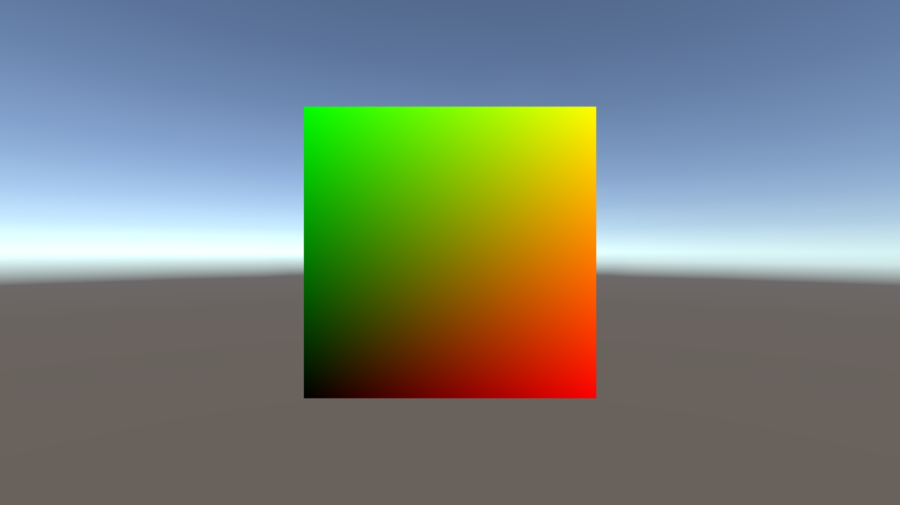

このサンプルでは、シェーダープログラミングのウォーミングアップとして、もっとも単純なシェーダーを作成します。

## サンプル02 フルスクリーンのシェーダー

シーン名: `02_Fullscreen.unity`

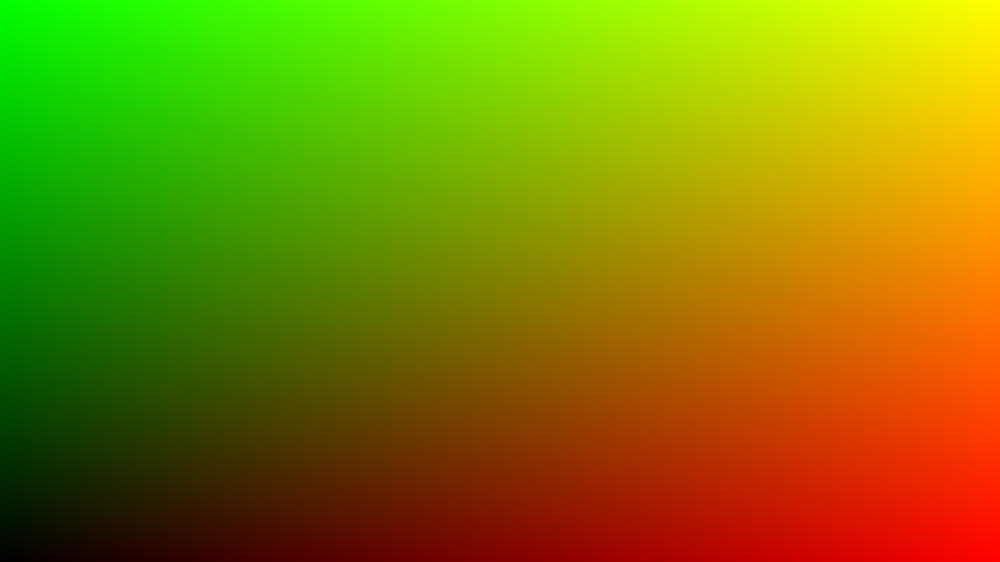

このサンプルでは、Quadをフルスクリーン描画する方法を解説します。

頂点シェーダーを書き換えることで、Unityのカメラの位置に関係なく、Quadが画面全体へ常に描画されるようになります。

## サンプル03 最初のレイマーチング

シーン名: `03_RaymarchingSphere.unity`

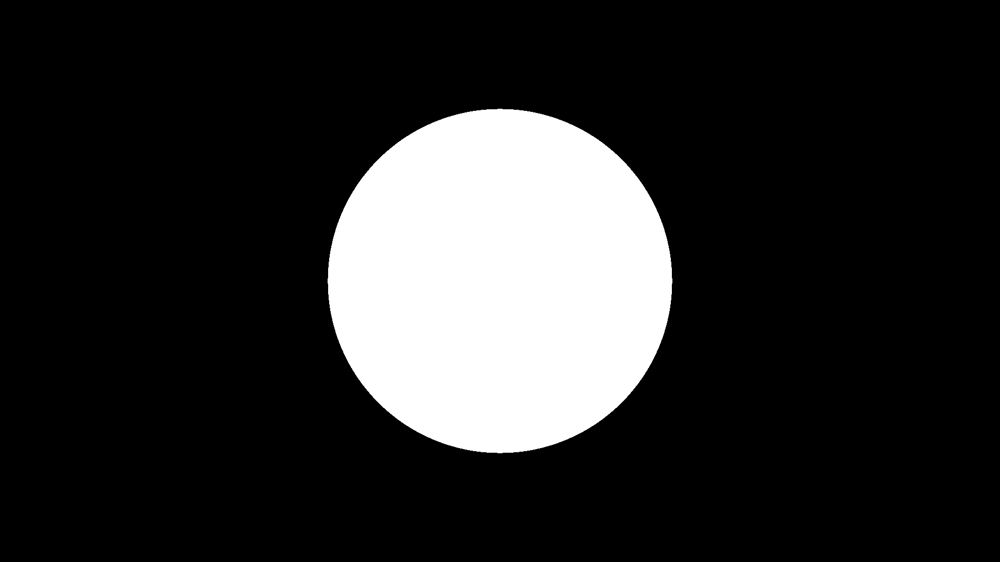

このサンプルからは、いよいよレイマーチングを実装します。

## サンプル04 法線の計算

シーン名: `04_RaymarchingNormal.unity`

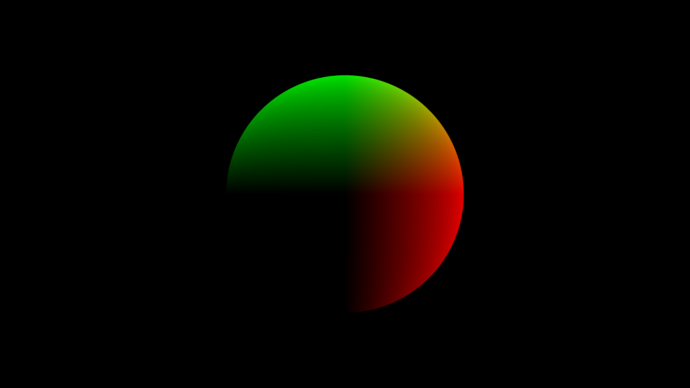

このサンプルではライティングに必要な法線の計算について解説します。

## サンプル05 内積による単純なライティング

シーン名: `05_RaymarchingShading.unity`

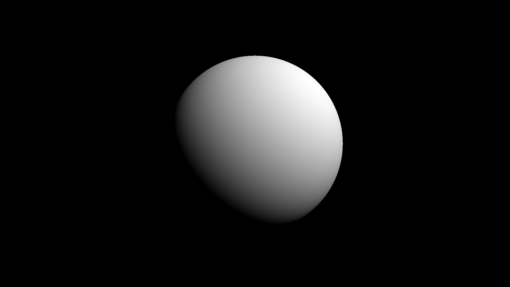

## サンプル06 床をシーンに追加

シーン名: `06_RaymarchingFloor.unity`

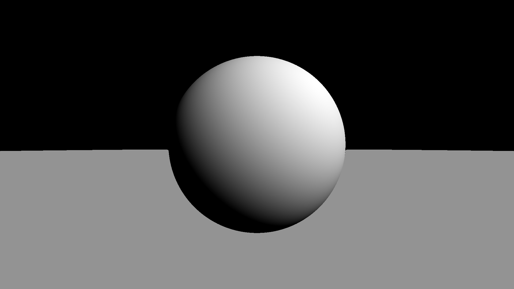

## サンプル07 マテリアル分けと高度なライティング

シーン名: `07_RaymarchingMaterial.unity`

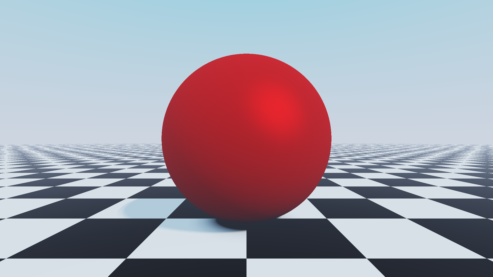

このサンプルではオブジェクトごとにマテリアル（色や材質など）を分ける方法と高度なライティングについて解説します。

## サンプル08 Unityのカメラとの同期

シーン名: `08_RaymarchingWithUnityCamera.unity`

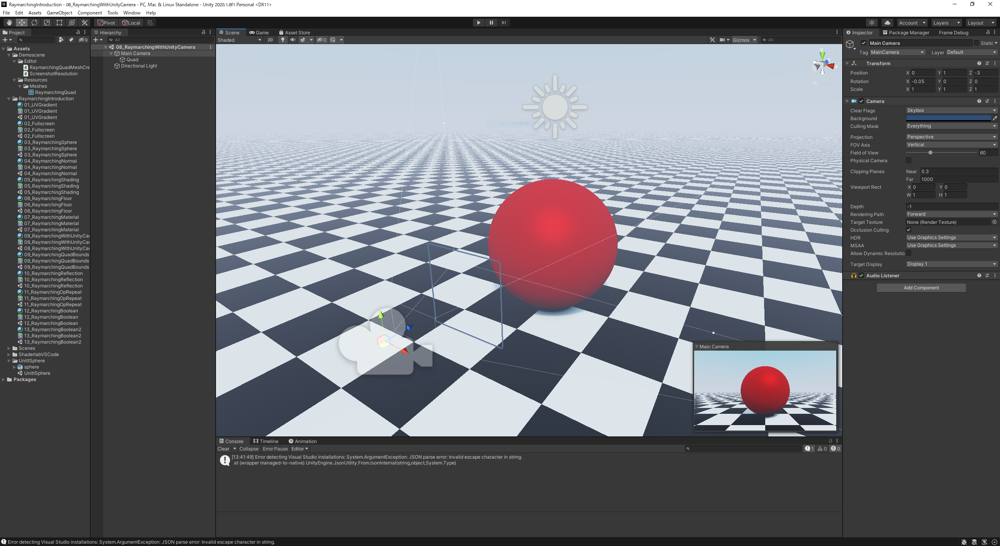

このサンプルではUnityのカメラとレイマーチングのカメラを同期する方法を解説します。

カメラを同期することで、Unityのカメラの設定からレイマーチング内のカメラを動かしたり、シーンビューの自由カメラのモードでレイマーチングの世界を探索したりできます。

## サンプル09 レイマーチング用のQuadのカリング防止

シーン名: `09_RaymarchingQuadBounds.unity`

このサンプルでは自由にカメラを動かしたときにフラスタムカリングでレイマーチングが描画されなくなる現象を解決します。

## サンプル10 レイトレーシングによる鏡面反射

シーン名: `10_RaymarchingReflection.unity`

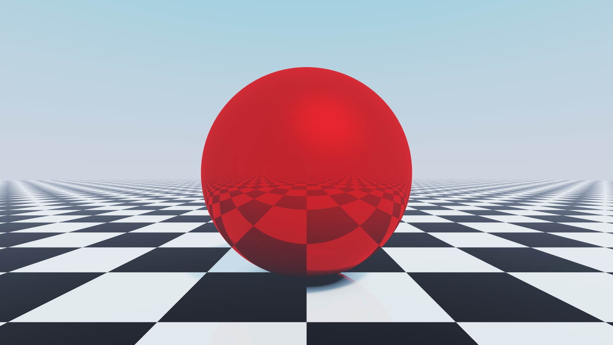

このサンプルではレイトレーシングによる鏡面反射を追加する方法を解説します。
図の中央のボールに床のチェッカー模様が写り込んでいますが、これが鏡面反射です。

## サンプル11 距離関数の応用：無限複製編

シーン名: `11_RaymarchingOpRepeat.unity`

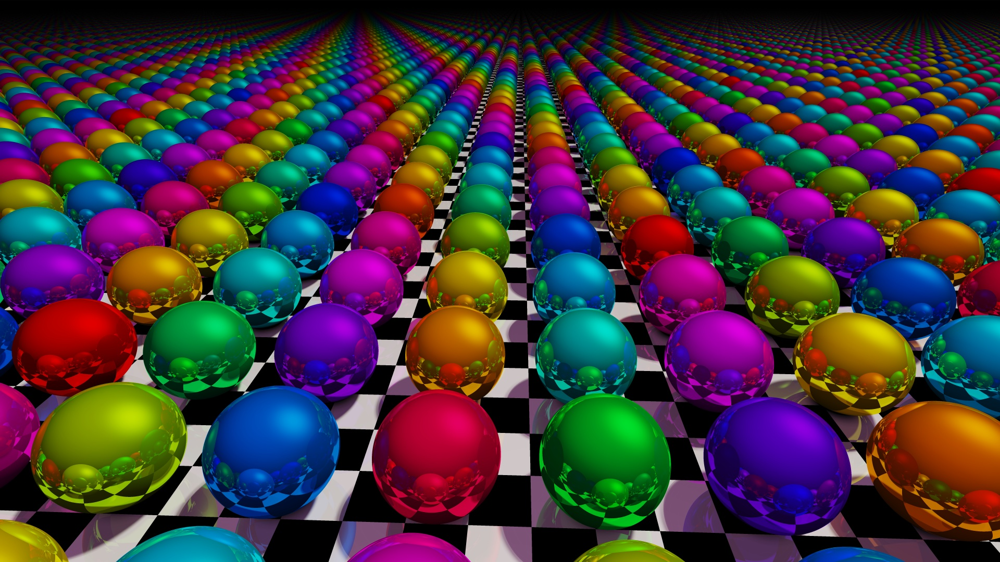

このサンプルでは、距離関数のオブジェクトを無限に複製する `opRep` というオペレーションを紹介します。

## サンプル12 距離関数の応用：ブーリアン演算による合成

シーン名: `12_RaymarchingBoolean.unity`

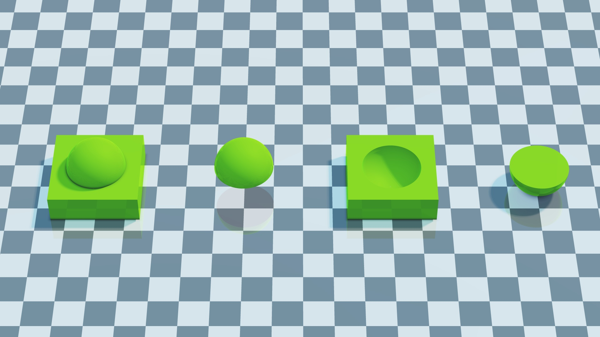

このサンプルでは、距離関数のブーリアン演算による合成を紹介します。

## サンプル13 距離関数の応用：無限複製とブーリアン演算の合せ技

シーン名: `13_RaymarchingBoolean2.unity`

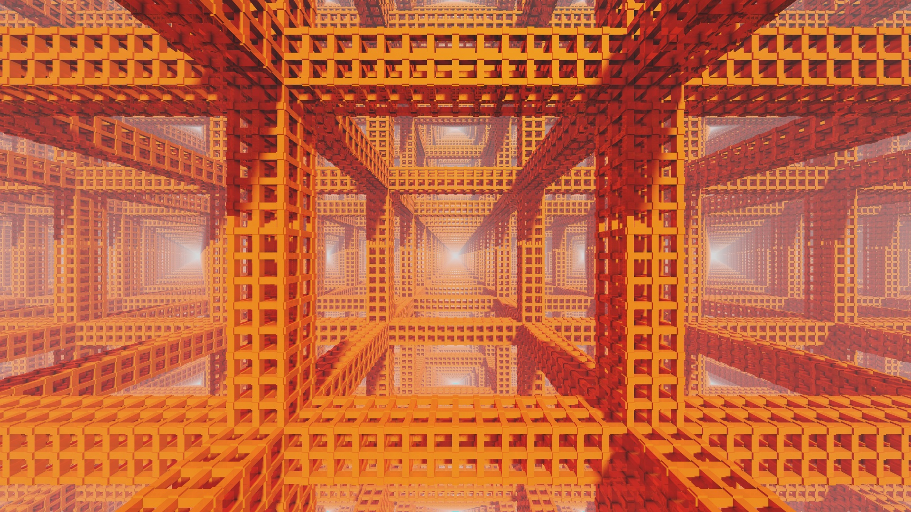

このサンプルでは、これまでに紹介した距離関数の無限複製とブーリアン演算を組み合わせることで、鉄骨のような雰囲気の形状をモデリングする方法を解説します。

## ランセンス

- ソースコードのライセンスはMITです。